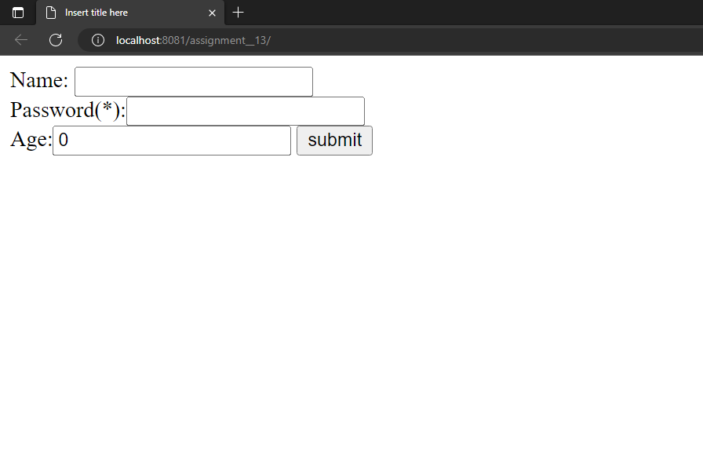

<h1>OUTPUTS : </h1>

<h2>main page: </h2>

<h2>when both username and password does not follow the constraints :  </h2>
<h3>password : "something"</h3>

<h2>when both username follows the constraint but password does not :  </h2>
<h3>password : "something"</h3>

<h2>when both username does not follow the constraints and password does :  </h2>
<h3>password : "something@java"</h3>

<h2>when both username and password follows the constraints :  </h2>
<h3>password : "something@java"</h3>
